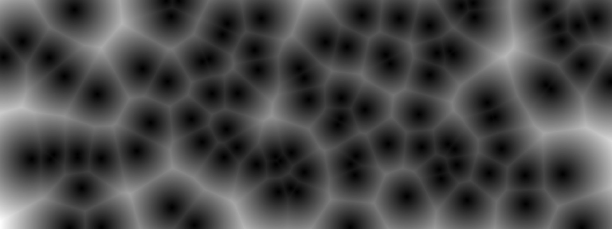

# Cellular texture generator
Tihs program generate cellular texture. If you want to make your ctg [this is](https://blackpawn.com/texts/cellular/default.html) a good material to start.
# Example
```sh
./ctg -w 200 -h 300 -p 20 -v cellurar.png
```

# Example texture generated by ctg

